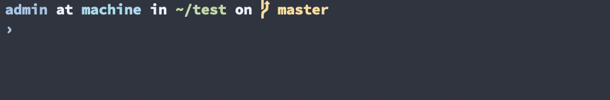

# nord-extended
[Oh My Zsh](https://github.com/ohmyzsh/ohmyzsh) theme in the [Nord](https://www.nordtheme.com/) color scheme.

To use it clone the repository inside your ohmyzsh folder with the following command:

    git clone https://github.com/fxbrit/nord-extended $ZSH/themes/nord-extended

and then in your `.zshrc` include the line `ZSH_THEME="nord-extended/nord"`.
I highly suggest to use the theme with Nord [Terminal.app](https://github.com/arcticicestudio/nord-terminal-app).

This theme is a modified version of [this](https://github.com/TyWR/Nord-zsh) one, many thanks to the owner of the repository.
